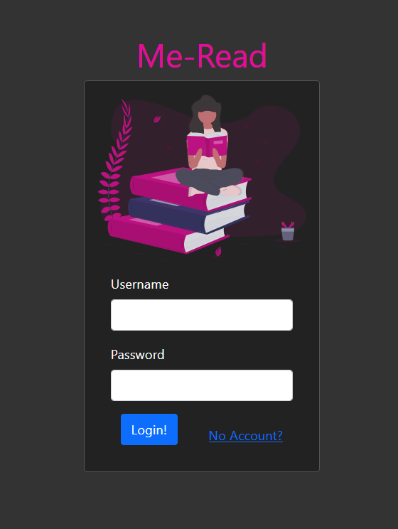
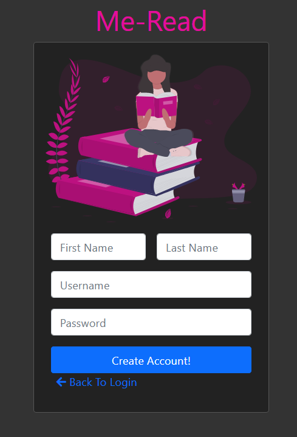
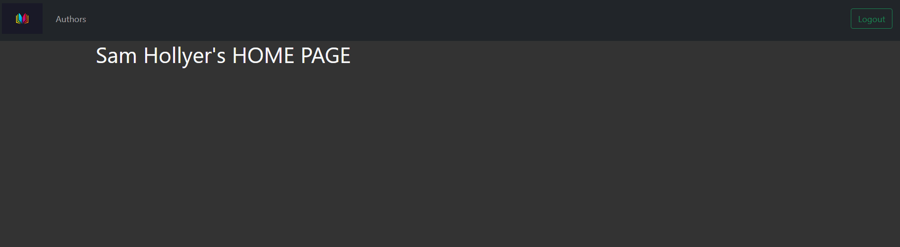
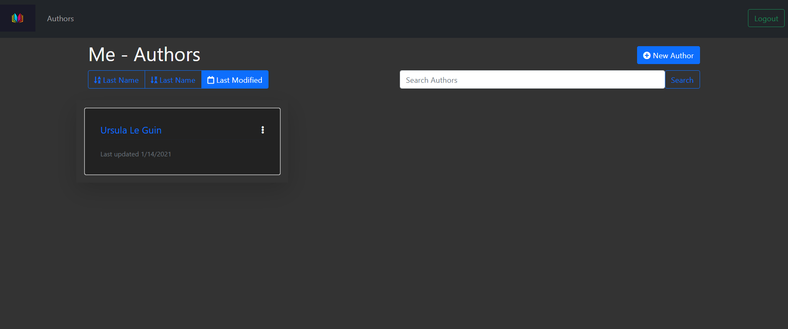
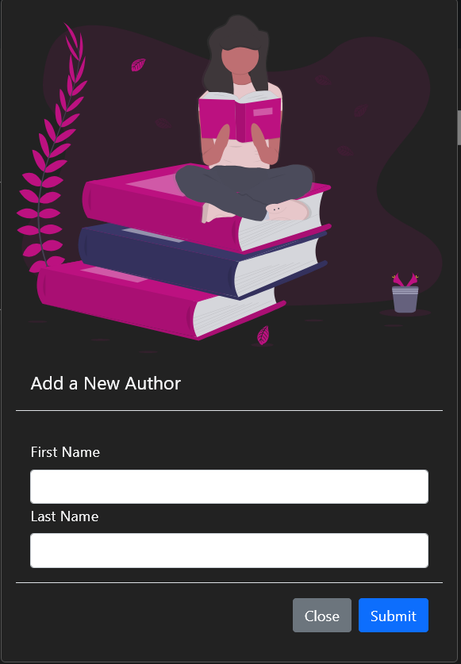
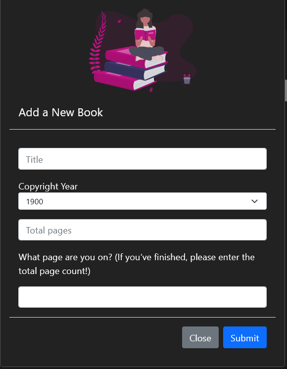
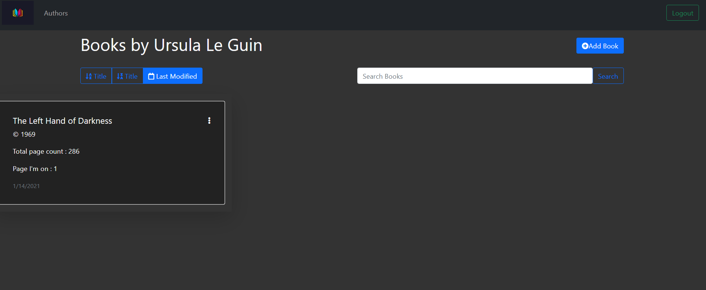

# Me-Read

## Description
A simple app that allows users to create an account and keep track of who they are reading and what books they've read.


## How to Use
A new user need only create an account by supplying their first and last name, a username, and a password. If they already have an account, they need only to login in on the home page. Once they enter the site, they will arrive at the user home page. From here, the user can visit the Authors page on the navbar and create a new Author card with their first and last name. This card has a unique link to a Books page that will let the user create a Book card with the title, copyright date, total page number, and current page number they are on.
Once their visit is complete, the user can logout of the site.

### Challenges
* Challenge: Accessing user data across the site
  - Using Filestore to save a cookie that follows the user around the site. 

* Challenge: Creating a search function that finds certain authors
  - Using methods in Sequelize, I was able to return data that matched the concatination of the first and last names of the author. I also was able to ignore case sensitivty.

* Challenge: How to sort by certain data
  - Using route methods and Sequelize, I was able to rerender the page using different routes that passed through an anchor tag that would cause the controller for the page render change how to return the data to the template engine. This was done like so:
  ```javascript

   if (id) {
        let authors = []
        try {
            if (sorted === "za") {
                authors = await Author.findAll({
                    where: {
                        UserId: id,
                    },
                    order: [
                        ["authorlast", "ASC"]
                    ]
                })

            } else if (sorted === "az") {
                authors = await Author.findAll({
                    where: {
                        UserId: id,
                    },
                    order: [
                        ["authorlast", "DESC"]
                    ]
                })
            } else {
                authors = await Author.findAll({
                    where: {
                        UserId: id,
                    },
                    order: [
                        ["updatedAt", "DESC"]
                    ]
                })
            }


  ```


### Future Development
This site is still a work in process. My goal is to have a more robust user homepage to display time series data in a chart that shows how much a user has read over a calendar month. I also want a user to be able to see how much of their current book they have yet to read and be displayed as a pie or donut chart. This will require some rethinking and redeploying my relational databases as well as find a good data display library.

## Demo
<h4>Login</h4>


<br>
<br>

<h4>Create User Account</h4>


<br>
<br>

<h4>User Home Page</h4>


<br>
<br>

<h4>Authors Page</h4>


<br>
<br>

<h4>Add Author</h4>


<br>
<br>

<h4>Add Book</h4>


<br>
<br>

<h4>Book page</h4>

